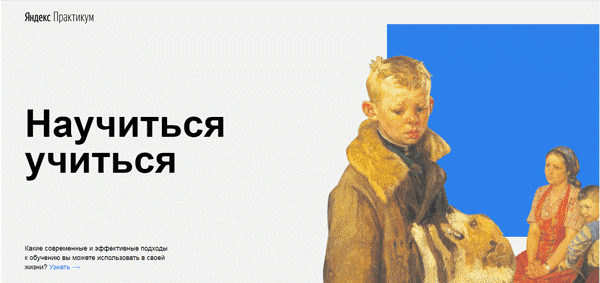

# Проектная работа №2

### Учебный курс "Веб-разработчик" от Яндекс.Практикума

Данная проектная работа является продолжением первой,  в которой начато изучение принципов **html** и **css**.

Помимо уже изученных БЭМ-методологии в html, флекс-вёрстки,  позиционирования, форматирования текста  **в новой работе были применены следующие техники:**

- файловая структура по правилам Nested БЭМ;
- анимация **@keyframes**;
- встроеный контент **iframes** (видео);
- интерактивные элементы.

Всё это помогает разнообразить и украсить веб-проект  при сохранении удобства дальнейшего расширения.
____

### Что дальше...

:symbols:Попробовать другие шрифты 
:smiley_cat:Добавить котиков 
:100:Дописать все вендорные префиксы для кроссбраузерности 
:checkered_flag:Сделать форму для связи со мной
____

#### Автор

:copyright: [_Сергей Дедиков_](mailto:serded59@ya.ru)
